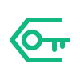

### Cipher

---

  
  &nbsp;&nbsp;
  

  

---

### // root@cipher:~# whoami

Security Researcher focusing on Offensive Operations and AI-driven exploitations. I specialize in maximizing impact within constrained environments—running full-scale red team ops directly from mobile terminals. Hardware limitations are just another puzzle to solve.

* **Current Op:** Automating reconnaissance pipelines.
* **Architecture:** Mobile-First / Termux / Cloud C2.
* **Focus:** Prompt Injection vectors & Network infiltration.

---

###  Project: Overwatch

**Proprietary Threat Intel Engine.**
A custom-built vulnerability scanner designed for speed and stealth. Currently deployed in a closed lab environment to simulate APT behaviors and automate attack vectors using LLMs.

---

###  Arsenal

**Security Tools**
 

&nbsp;

&nbsp;

  

**AI & Logic**
 

&nbsp;

  

**Core Languages**
 

&nbsp;

&nbsp;

---

###  Stats & Metrics

  

 

---

###  Commit Topology

---

### // Connect

&nbsp;

&nbsp;

&nbsp;

  

**"deciphering the future before it happens..."**

