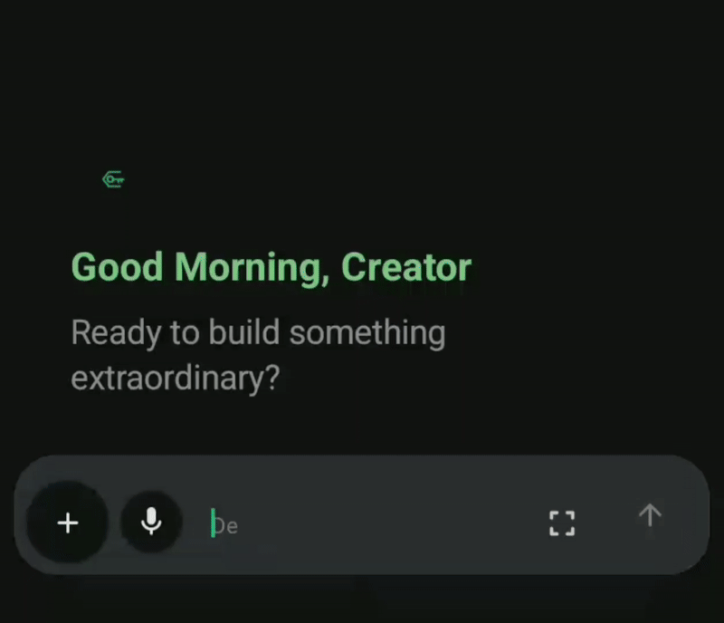

<!-- HEADER START -->
<table width="100%" border="0" cellspacing="0" cellpadding="0" background="https://i.pinimg.com/originals/c8/b2/8d/c8b28d6c79b940909403de4c75908227.gif" style="background-image: url('https://i.pinimg.com/originals/c8/b2/8d/c8b28d6c79b940909403de4c75908227.gif'); background-size: cover; border-radius: 10px; color: white;">
  <tr>
    <td width="50%" valign="top" style="padding: 10px;">
      <div align="center">
       
        <br/>
        <h3 style="color: #ffffff; margin-bottom: 5px;">~/.ωнσαмι</h3>
        <h1 style="margin-top: 0;"><kbd style="background-color: #000; color: #FF0000; border: 1px solid #FF0000; padding: 5px; border-radius: 5px;"> C I P H E R </kbd></h1>
        <p>
          
          
        </p>
        
      </div>
      <div style="background-color: rgba(0,0,0,0.9); padding: 15px; border-radius: 10px; border-left: 3px solid #FF0000; margin-top: 10px;">
        <h4 style="color: #FF0000; margin-top: 0; font-family: monospace;">// root@¢ιρнєя:~# cat description.txt</h4>
        <p style="color: #dddddd; font-size: 13px; line-height: 1.5;">
          red teamer focusing on <b>мobile-first σffensive Security</b>. honestly, forget the heavy rigs.. i'm just deploying full attack vectors straight from my phone. by leveraging <b>Termux</b> & some custom chroot environments, i basically flip standard mobile hardware into a weaponized C2 node.
        </p>
               <ul style="color: #dddddd; font-size: 12px; padding-left: 20px;">
          <li>running on <b>AArch64</b> via proot-distro/nethunter.</li>
          <li>mostly focused on <b>Cellular egress</b> & gray-man tactics to stay under the radar.</li>
          <li>plus, i use <b>Python</b> for all my air-gapped extraction automation.</li>
        </ul>
      </div>
    </td>
    <td width="50%" align="center" valign="top" style="padding: 10px;">
      
      <br/><br/>
      <div style="background-color: #050505; border: 1px dashed #FF0000; border-radius: 5px; padding: 10px; text-align: left;">
        <p style="color: #ffffff; font-size: 11px; font-family: monospace; margin: 0 0 8px 0;">
          <span style="color: #FF0000;">>_</span> <b>ιиfяα:</b><br/>
          basically running a headless kali setup inside android user-space. no cloud, no bs—everything is 100% Local execution.
        </p>
        <p style="color: #ffffff; font-size: 11px; font-family: monospace; margin: 0 0 8px 0;">
          <span style="color: #FF0000;">>_</span> <b>тαℓк:</b><br/>
          honestly, the most dangerous computer is the one you’ve got in your pocket right now.
        </p>
        <hr style="border-color: #333;" />
        <p style="color: #ff4444; font-size: 10px; font-family: monospace; margin: 0; font-style: italic;">
          ​!! нєα∂ѕ υρ:
authorized access only. i’m watching the logs, so stay out.
        </p>
      </div>
    </td>
  </tr>
</table>

<br/>

<!-- MISSION SECTION -->
<h3 align="left">  current_focus </h3>
<p align="left">
  doing some <b>vulnerability research</b> and <b>exploit dev</b> on the side. basically scanning targets, sniffing packets, and just automating payloads for fun. this profile is where i track my tools and activity while building stuff for the offensive security community.
</p>

<hr/>

<!-- METRICS & WAKATIME SECTION -->
<h3 align="left">>_ℓινє_ℓσgѕ</h3>
<div align="center">

  
  <!--START_SECTION:waka-->


**🐱 My GitHub Data** 

> 📦 25.6 kB Used in GitHub's Storage 
 > 
> 🏆 1,766 Contributions in the Year 2026
 > 
> 🚫 Not Opted to Hire
 > 
> 📜 28 Public Repositories 
 > 
> 🔑 20 Private Repositories 
 > 
**I'm a Night 🦉** 

```text
🌞 Morning                240 commits         ██░░░░░░░░░░░░░░░░░░░░░░░   08.50 % 
🌆 Daytime                993 commits         █████████░░░░░░░░░░░░░░░░   35.18 % 
🌃 Evening                872 commits         ████████░░░░░░░░░░░░░░░░░   30.89 % 
🌙 Night                  718 commits         ██████░░░░░░░░░░░░░░░░░░░   25.43 % 
```
📅 **I'm Most Productive on Monday** 

```text
Monday                   554 commits         █████░░░░░░░░░░░░░░░░░░░░   19.62 % 
Tuesday                  409 commits         ████░░░░░░░░░░░░░░░░░░░░░   14.49 % 
Wednesday                349 commits         ███░░░░░░░░░░░░░░░░░░░░░░   12.36 % 
Thursday                 305 commits         ███░░░░░░░░░░░░░░░░░░░░░░   10.80 % 
Friday                   477 commits         ████░░░░░░░░░░░░░░░░░░░░░   16.90 % 
Saturday                 316 commits         ███░░░░░░░░░░░░░░░░░░░░░░   11.19 % 
Sunday                   413 commits         ████░░░░░░░░░░░░░░░░░░░░░   14.63 % 
```


📊 **This Week I Spent My Time On** 

```text
💬 Programming Languages: 
No Activity Tracked This Week
```

**I Mostly Code in TypeScript** 

```text
TypeScript               10 repos            ███████░░░░░░░░░░░░░░░░░░   28.57 % 
Python                   9 repos             ██████░░░░░░░░░░░░░░░░░░░   25.71 % 
JavaScript               5 repos             ████░░░░░░░░░░░░░░░░░░░░░   14.29 % 
Kotlin                   3 repos             ██░░░░░░░░░░░░░░░░░░░░░░░   08.57 % 
Dart                     1 repo              █░░░░░░░░░░░░░░░░░░░░░░░░   02.86 % 
```


**Timeline**


 Last Updated on 19/03/2026 02:08:53 UTC
<!--END_SECTION:waka-->
  <br /><br />
  <table align="center" border="0" cellspacing="0" cellpadding="0">
    <tr>
      <td align="center">
        
      </td>
      <td align="center">
        
      </td>
    </tr>
  </table>
  <br />
  


  <h4 align="center" style="color: #FF0000;">>_му_α¢тινιту's</h4>
  
  <br />
  <p align="center">
      
      
      
      
      
  </p>
  <code>CORE_STRENGTH: OFFSEC</code> | <code>ˢᵗᵃᵗᵘˢ: 𝖔𝖓𝖑𝖎𝖓𝖊</code>
</div>

<hr/>

<!-- FOOTER CONNECT -->
<h3 align="left">>_ᥴꪮꪮꪑ𝘴..</h3>
<div align="center">
<a href="https://x.com/Cipher_attacks"></a>
&nbsp;
<a href="https://www.youtube.com/@cipher-attack"></a>
&nbsp;
<a href="https://et.linkedin.com/in/cipher-attack-93582433"></a>
&nbsp;
<a href="https://github.com/cipher-attack"></a>

<br /><br />
<div style="font-family: monospace; color: #888; font-size: 13px; text-align: center; margin-top: 20px;">
  𝚝𝚑𝚎 𝚜𝚢𝚜𝚝𝚎𝚖 𝚒𝚜𝚗'𝚝 𝚛𝚎𝚊𝚕𝚕𝚢 𝚋𝚛𝚘𝚔𝚎𝚗. 𝚒𝚝 𝚠𝚊𝚜 𝚓𝚞𝚜𝚝 𝚋𝚞𝚒𝚕𝚝 𝚝𝚑𝚒𝚜 𝚠𝚊𝚢. 𝚒 𝚓𝚞𝚜𝚝 𝚑𝚊𝚙𝚙𝚎𝚗𝚍 𝚝𝚘 𝚏𝚒𝚗𝚍 𝚝𝚑𝚎 𝚍𝚘𝚘𝚛.
</div>

